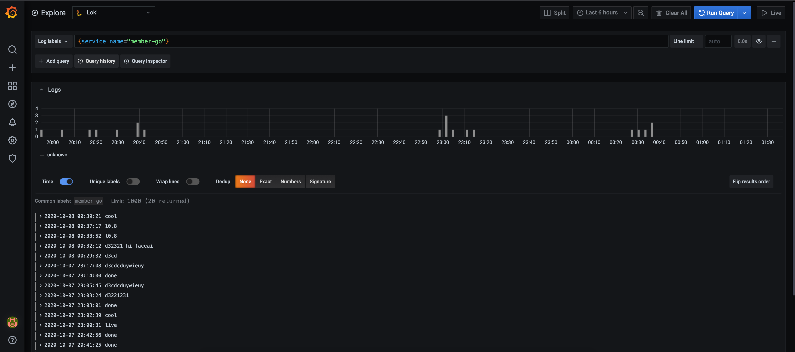
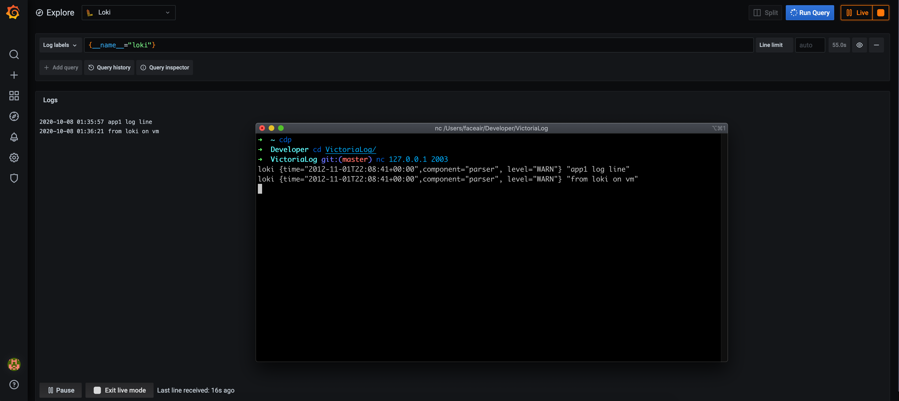

# Loki On VictoriaMetrics

This project experimentally supports the [loki](https://grafana.com/docs/loki/latest/overview/) protocol on the VictoriaMetrics Cluster, and performance may be better.

Supported:
* LogQL, extends MetricsQL to support [filter expressions](https://grafana.com/docs/loki/latest/logql/#filter-expression) and full PromQL & MetricsQL support for querying metrics.
* Major HTTP API
  * /loki/api/v1/query
  * /loki/api/v1/query_range
  * /loki/api/v1/label & /loki/api/v1/labels
  * /loki/api/v1/label/<name>/values
  * /loki/api/v1/tail (websocket)
  * /loki/api/v1/push
* Additional support for prometheus-style data writing via tcp, like `loki{time="2012-11-01T22:08:41+00:00",component="parser",level="WARN"} "app log line"`

Screenshot:

